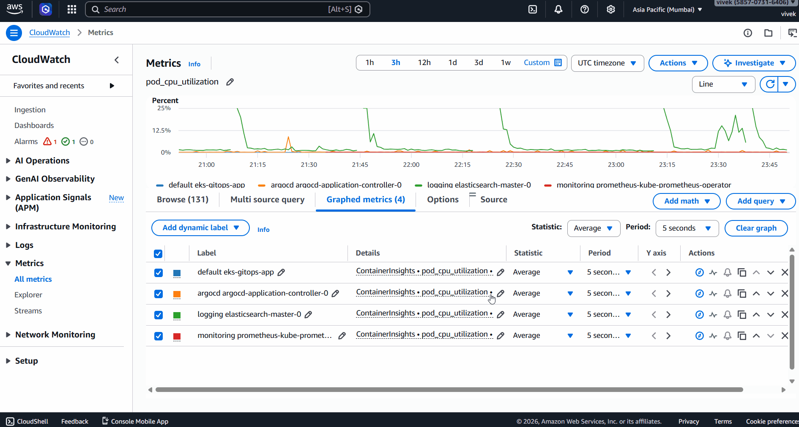
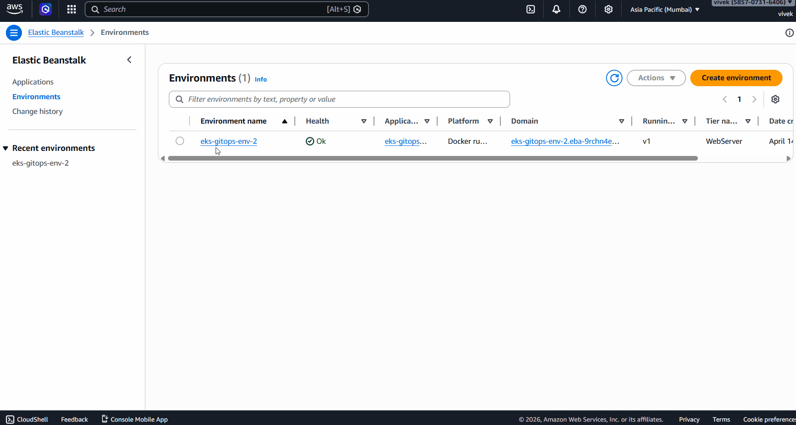

# 🚀 Enterprise-Grade EKS GitOps Platform

> **Production-grade Kubernetes platform on AWS** — Full GitOps, Multi-Stack Observability, AWS-Native CI/CD, and Infrastructure as Code across 5 technology layers.

[](https://aws.amazon.com)
[](https://kubernetes.io)
[](https://argoproj.github.io)
[](https://terraform.io)
[](https://helm.sh)

---

## 📸 Platform in Action

### 🔍 Observability — ELK Stack (789 Live Log Events)


### 📊 Kibana Observability Overview


### 🔄 ArgoCD GitOps Auto-Sync


### ☁️ AWS CloudWatch metrics


### 🌱 Elastic Beanstalk Docker Deployment


### 📈 Grafana — Live Kubernetes Metrics


### 📋 Grafana — All Dashboards (15+)

[](assets/grafana-dashboards-list.gif)

### 🔬 Grafana — Namespace-Level Metrics

[](assets/grafana-namespace-metrics.gif)

### ☁️ AWS CloudWatch Container Insights


---

## 🏗️ Architecture

```
┌──────────────────────────────────────────────────────────────────┐
│                     Developer Workflow                            │
│                                                                   │
│   git push ──► GitHub Actions ──► ECR ──► ArgoCD ──► EKS        │
└──────────────────────────────────────────────────────────────────┘
                                │
              ┌─────────────────┼──────────────────┐
              ▼                 ▼                  ▼
       ┌────────────┐   ┌────────────┐   ┌─────────────┐
       │  GitHub    │   │ CodeBuild  │   │   ArgoCD    │
       │  Actions   │   │  + ECR     │   │   GitOps    │
       └────────────┘   └────────────┘   └─────────────┘
                                               │
                         ┌─────────────────────▼──────────────────────┐
                         │              AWS EKS v1.31                  │
                         │   ┌──────────┐  ┌──────────┐  ┌─────────┐ │
                         │   │  ArgoCD  │  │   App    │  │  Helm   │ │
                         │   │ v3.3.6   │  │ (nginx)  │  │ Charts  │ │
                         │   └──────────┘  └──────────┘  └─────────┘ │
                         │   ┌──────────┐  ┌──────────┐  ┌─────────┐ │
                         │   │   ELK    │  │Prometheus│  │CloudWtch│ │
                         │   │  Stack   │  │+ Grafana │  │ Agent   │ │
                         │   └──────────┘  └──────────┘  └─────────┘ │
                         │         3 nodes (t3.small) — ap-south-1    │
                         └────────────────────────────────────────────┘
                                               │
               ┌───────────────────────────────┼──────────────────────┐
               ▼                               ▼                      ▼
       ┌──────────────┐               ┌──────────────┐      ┌──────────────┐
       │  CloudWatch  │               │  CloudTrail  │      │  S3 + ECR    │
       │  Insights    │               │  Audit Logs  │      │  Artifacts   │
       │  332 metrics │               │  Multi-region│      │  Terraform   │
       └──────────────┘               └──────────────┘      └──────────────┘
```

---

## ✅ What Was Built — Sprint by Sprint

### Sprint 1 — Foundation Infrastructure
- **VPC** — Custom VPC with public/private subnets, NAT gateway via **CloudFormation**
- **EKS v1.31** — Multi-node Kubernetes cluster provisioned with **AWS CDK**
- **ALB Controller** — AWS Load Balancer Controller deployed via Helm
- **Ansible** — Node hardening playbook for security compliance

### Sprint 2 — GitOps & CI/CD
- **GitHub Actions** — 3-stage pipeline (build → test → deploy) with Docker + ECR integration
- **ArgoCD v3.3.6** — Full GitOps: auto-syncs Helm charts from GitHub to EKS on every push
- **Helm** — All workloads packaged as Helm charts with configurable `values.yaml`
- Self-healing: ArgoCD auto-reverts any manual changes to match Git state

### Sprint 3 — Full Observability Stack
- **Elasticsearch + Kibana 8.5** — Centralized log storage and visualization (**789 live log events**)
- **Filebeat** — DaemonSet shipping container logs from all pods across all namespaces
- **Prometheus + Grafana** — Metrics collection with **15+ pre-built Kubernetes dashboards**
- **CloudWatch Container Insights** — Pod-level CPU/memory/network (**332 metrics flowing**)

### Sprint 4 — AWS Native Services
- **CloudTrail** — Multi-region audit trail with log delivery to S3
- **CodeBuild** — Docker image build pipeline pushing to ECR
- **Elastic Beanstalk** — Docker app deployed from ECR (**Green health confirmed**)
- **EKS Control Plane Logging** — API server, audit, authenticator logs enabled

### Sprint 5 — IaC & Additional CI/CD
- **Terraform** — S3 artifact bucket with versioning, encryption, and resource tagging
- **GitLab CI** — `.gitlab-ci.yml` pipeline with build, test, deploy stages

---

## 🛠️ Complete Tech Stack

### ☁️ Cloud & Infrastructure
| Tool | Version | Usage |
|------|---------|-------|
| AWS EKS | v1.31 | Managed Kubernetes cluster |
| AWS CDK | v2 | EKS cluster provisioning |
| CloudFormation | — | VPC and networking |
| Terraform | v1.11 | S3 artifact storage (IaC) |
| AWS ECR | — | Docker image registry |
| Elastic Beanstalk | AL2023 | PaaS Docker deployment |
| CloudTrail | — | Multi-region audit logging |
| CloudWatch | — | Container Insights (332 metrics) |

### 🔄 CI/CD & GitOps
| Tool | Version | Usage |
|------|---------|-------|
| GitHub Actions | — | CI/CD pipeline (3 stages) |
| ArgoCD | v3.3.6 | GitOps auto-sync from GitHub |
| CodeBuild | — | AWS-native Docker builds |
| GitLab CI | — | Alternative pipeline |
| Helm | v3.14 | Kubernetes package management |

### 📊 Observability
| Tool | Version | Usage |
|------|---------|-------|
| Elasticsearch | 8.5.1 | Log storage and indexing |
| Kibana | 8.5.1 | Log visualization (789 events) |
| Filebeat | 8.5.1 | Log shipping DaemonSet |
| Prometheus | v0.90.1 | Metrics scraping |
| Grafana | Latest | 15+ pre-built dashboards |

### 🔒 Security & Networking
| Tool | Usage |
|------|-------|
| Ansible | Node hardening playbook |
| ALB Controller | AWS Load Balancer ingress |
| IAM / IRSA | Service account roles |
| VPC | Custom networking with subnets |
| Security Groups | Fine-grained port access |

---

## 🔑 Real-World Problems Solved

These are actual issues encountered and resolved — not tutorial steps:

| Problem | Root Cause | Solution |
|---------|-----------|----------|
| Pods stuck in Pending | t3.small hit 11-pod limit | Scaled node group 1 → 3 nodes |
| ALB not provisioning | Missing `DescribeListenerAttributes` IAM permission | Added inline policy to ALB controller role |
| Kibana `.security` index missing | Elasticsearch restarted before bootstrap completed | Manually regenerated Kibana service token via ES API |
| CloudWatch `MissingEndpoint` error | Agent missing region config | Patched cwagentconfig with explicit region |
| Git push rejected (685MB file) | Terraform provider binary committed to Git | Used `git filter-branch` to rewrite history |
| Kibana auth failure after restart | Stale service account token | Deleted and recreated token via `/_security/service/` API |

---

## 📁 Repository Structure

```
eks-gitops-platform/
├── .github/workflows/        # GitHub Actions CI/CD pipeline
├── .gitlab-ci.yml            # GitLab CI pipeline (build/test/deploy)
├── helm/eks-gitops-app/      # Application Helm chart
│   ├── Chart.yaml
│   ├── values.yaml
│   └── templates/deployment.yaml
├── terraform/main.tf         # S3 bucket with versioning (Terraform)
├── argocd-app.yaml           # ArgoCD Application manifest
├── buildspec.yml             # AWS CodeBuild specification
├── Dockerfile                # Docker image definition
├── Dockerrun.aws.json        # Elastic Beanstalk Docker config
├── elasticsearch-values.yaml # Elasticsearch Helm overrides
├── kibana-values.yaml        # Kibana Helm overrides
├── filebeat-values.yaml      # Filebeat Helm overrides
├── prometheus-values.yaml    # Prometheus + Grafana overrides
├── assets/                   # Portfolio GIFs and screenshots
└── README.md
```

---

## 📊 Platform Metrics

| Metric | Value |
|--------|-------|
| EKS Version | v1.31.13-eks-ecaa3a6 |
| Total Namespaces | 7 |
| Total Pods Running | 25+ |
| Kibana Log Events | 789 (last 15 min) |
| Log Rate | 44 events/minute |
| CloudWatch Metrics | 332 |
| Cluster CPU | 54% utilized |
| Cluster Memory | 85% utilized |
| Grafana Dashboards | 15+ pre-built |
| CI/CD Stages | 3 (build / test / deploy) |

---

## 🎯 Interview Talking Points

**"Tell me about your Kubernetes experience"**
> I built a multi-node EKS v1.31 cluster from scratch using AWS CDK, deployed 25+ pods across 7 namespaces, and resolved real production issues — pod scheduling failures, IAM permission gaps, and resource constraints.

**"How have you implemented GitOps?"**
> I deployed ArgoCD v3.3.6 with automated sync — any git push auto-deploys to EKS with self-healing. The entire cluster state is declared in Git. I also wrote a GitLab CI pipeline as an alternative to GitHub Actions.

**"What observability tools have you used?"**
> I built a dual observability stack: ELK (789 live log events at 44/min) and Prometheus + Grafana (15+ dashboards). Also enabled CloudWatch Container Insights — 332 metrics flowing from all namespaces.

**"Have you used Terraform?"**
> Yes — Terraform for S3, CDK for EKS, CloudFormation for VPC. I understand multiple IaC tools and when to use each.

**"Tell me about a problem you solved"**
> Kibana kept failing after Elasticsearch restarts because the `.security` index didn't bootstrap in time. I diagnosed it from pod logs, traced it to a stale service account token, and fixed it by calling the Elasticsearch security API to regenerate the token. That's the kind of real debugging experience this project gave me.

---

## 👤 Author

**Vivek Bommalla**
- 📧 vivekbommalla1251@gmail.com
- 💼 [LinkedIn](https://linkedin.com/in/vivekbommalla1251)
- 🐙 [GitHub](https://github.com/vivek1251)

---

<p align="center">
<b>Every component deployed, debugged, and verified on real AWS infrastructure.</b><br>
<i>Not a tutorial follow-along — real problems encountered and solved.</i>
</p>
